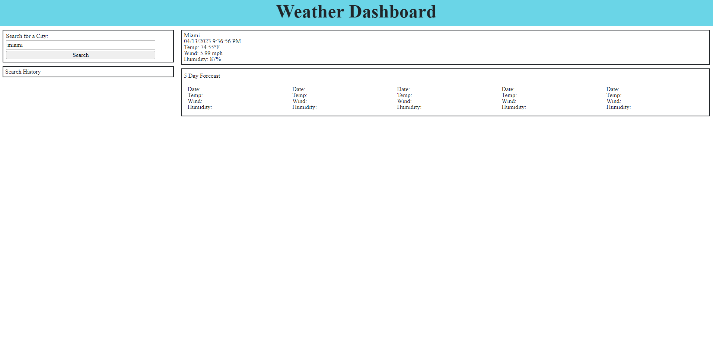

# Bootcamp Homework 6 - Weather Forecast

## Description

This application is designed to allow the user to search for the city of their choice. Once searched, the user will be displayed with the current weather conditions of their selected city, as well as a 5 day forecast. All searched cities are added to the search history list, and when clicked, the results for the previously searched city is displayed again.

## Credits

This application utilizes both the OpenWeatherAPI 5-day Forecast API & the OpenWeatherAPI Current Weather API.

<a href="https://github.com/drewkretschmar/Bootcamp-Homework-6">Github Repository</a>

<a href="https://drewkretschmar.github.io/Bootcamp-Homework-6/">Deployed Application Link</a>